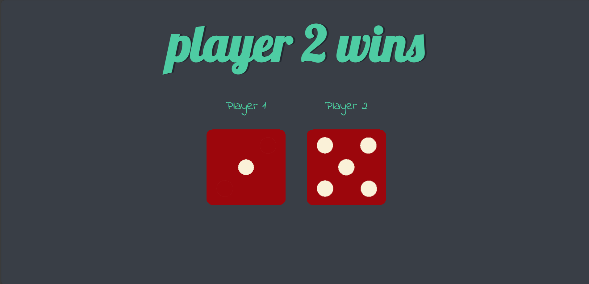

## Table of contents
  - [The challenge](#the-challenge)
  - [Screenshot](#screenshot)
  - [Built with](#built-with)
  - [Author](#author)

### The challenge
  - User should be able to role the dicee every time website is reload.
  - When player1, player2 or it is draw, it should show the result on the top.

### Screenshot

- desktop-view:
  

### Built with

- HTML5 markup
- CSS properties
- javascript

### Author

-see my other challenges on Frontend Mentor:
       Frontend Mentor - (https://www.frontendmentor.io/profile/Ajinkya9834)

-My Linkedin profile - (www.linkedin.com/in/ajinkya-hajare)
